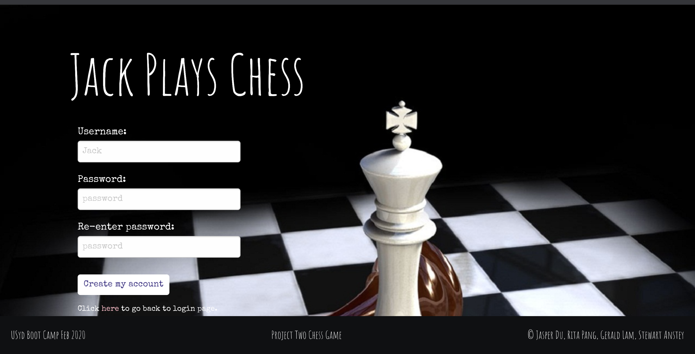

Sydney Uni Bootcamp 2019

# Project TWO Group Work 

Contributors:

- Anstey, Stewart
- Pang, Rita
- Du, Jasper
- Lam, Gerald

## Description

3D Chess Game

Please see the application's screenshot as follows:

.
.
.
.

## Table of Contents (Optional)

- [Installation](#installation)
- [Usage](#usage)
- [Credits](#credits)
- [License](#license)

## Installation

If you want to get a copy of the project on your own machine, you can do so using git.

Simply `git clone https://github.com/Jasper8628/Group_Project_2.git` while in your target folder.

## Usage

Go to the following link: 

https://project2-chessgame.herokuapp.com/

- To play both as white and black (One Player), simply click "New Game" to play
- To play against an opponent, click "New Game" then "Ready" and await for the opponent to click "Ready"
- To be an Observer, click "Ready" until you are allocated as an Observer 
- Click "Save" after the game and Click "Replay" to rewatch the game

HAVE FUN!

**Note**
- If chat window cannot be clicked please press "Tab" until you are able to type in the chat 

## Credits

Collaborators

- No outside collaborators.

## Libraries and Frameworks

<b>Build with<b>

- JQuery v3.4.1
- NodeJS
- Express.js
- Foundation v6.4.3
- Sequelize
- Socket.io
- Three.js
- Fusion 360

## License

MIT License

Copyright (c) 2019 Stewart Anstey, Rita Pang, Jasper Du, Gerald Lam

Permission is hereby granted, free of charge, to any person obtaining a copy
of this software and associated documentation files (the "Software"), to deal
in the Software without restriction, including without limitation the rights
to use, copy, modify, merge, publish, distribute, sublicense, and/or sell
copies of the Software, and to permit persons to whom the Software is
furnished to do so, subject to the following conditions:

The above copyright notice and this permission notice shall be included in all
copies or substantial portions of the Software.

THE SOFTWARE IS PROVIDED "AS IS", WITHOUT WARRANTY OF ANY KIND, EXPRESS OR
IMPLIED, INCLUDING BUT NOT LIMITED TO THE WARRANTIES OF MERCHANTABILITY,
FITNESS FOR A PARTICULAR PURPOSE AND NONINFRINGEMENT. IN NO EVENT SHALL THE
AUTHORS OR COPYRIGHT HOLDERS BE LIABLE FOR ANY CLAIM, DAMAGES OR OTHER
LIABILITY, WHETHER IN AN ACTION OF CONTRACT, TORT OR OTHERWISE, ARISING FROM,
OUT OF OR IN CONNECTION WITH THE SOFTWARE OR THE USE OR OTHER DEALINGS IN THE
SOFTWARE.

---

© 2019 Code Connoisseurs, Sydney, Australia. All Rights Reserved.

If you are still reading you get [this bonus comic strip about Git](https://xkcd.com/1597/).
